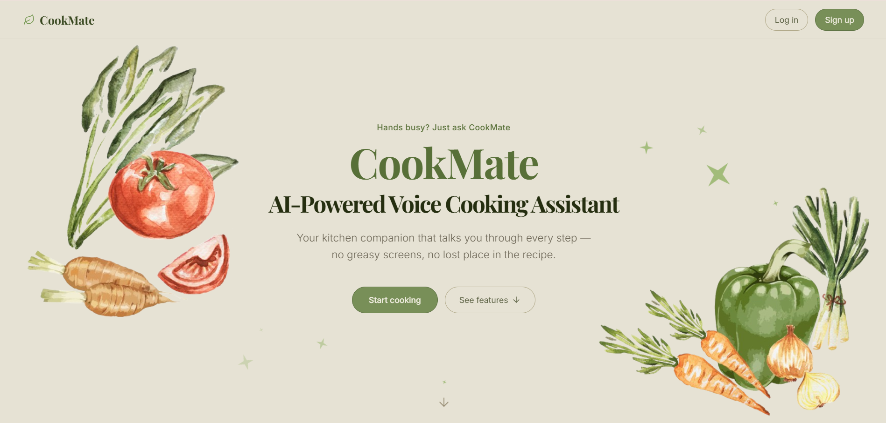
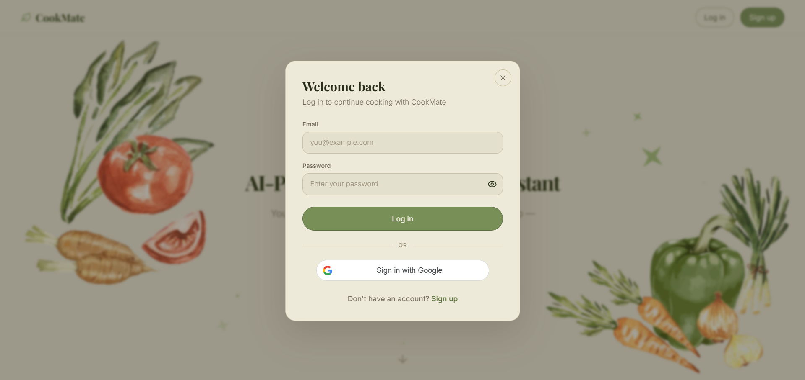
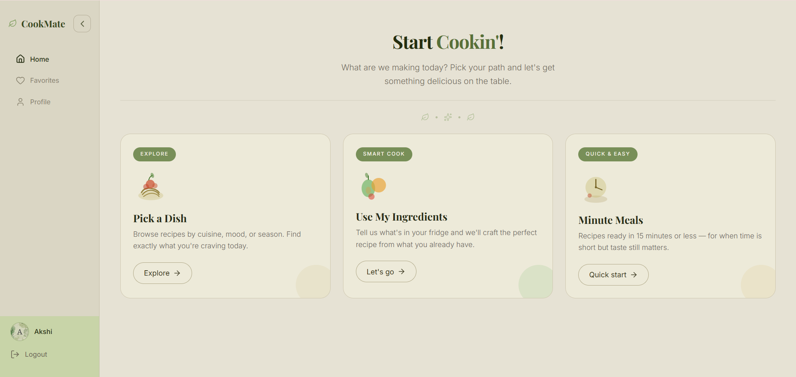
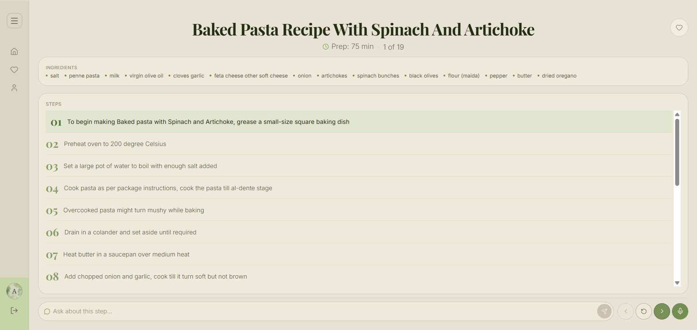
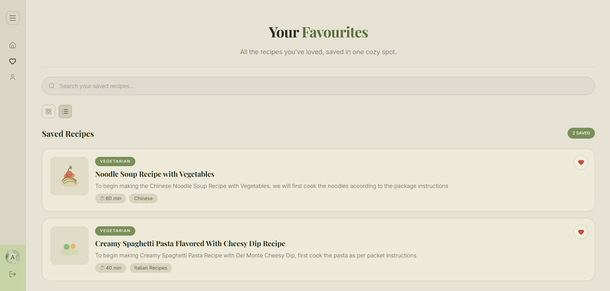
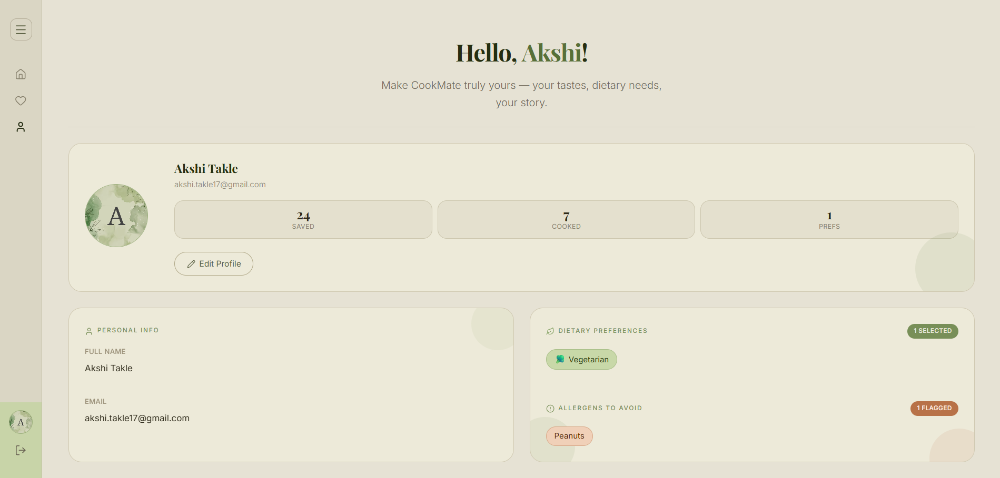

# CookMate 🍳

CookMate is a full-stack, voice-enabled AI cooking assistant to make cooking more interactive and hands-free. It helps users discover recipes, guides them through the cooking process step-by-step, and answers real-time cooking doubts like ingredient substitutions or fixing mistakes. The assistant also remembers user preferences to provide more personalized assistance.

---

## 1. Project Overview

Cooking can be challenging for beginners and busy individuals, especially when multitasking. Traditional recipe apps often require constant touch interaction, which can be inconvenient when hands are messy or occupied. Recipes are also largely static, making it difficult to account for individual dietary preferences and allergies, while missing ingredients or cooking mistakes can lead to frustration and wasted food. This creates a need for a hands-free, intelligent cooking assistant that can provide personalized, real-time guidance throughout the cooking process.

CookMate addresses these challenges by combining voice-based interaction, semantic recipe retrieval, and LLM-powered assistance. It helps users discover recipes that match their available ingredients, dietary preferences, allergies, and time constraints, while a RAG-based recipe knowledge base keeps retrieval grounded in a curated collection of recipes.

Once you've picked a dish, CookMate turns into an interactive cooking companion: it can modify the recipe on request (e.g. "make it vegan", "remove nuts"), guide you through it step-by-step, and answer questions about the step you're currently on — all in natural language.

---

## 2. Key Features

* **Smart Recipe Search** — semantic search over a curated recipe database to find recipes relevant to the user's query.

* **Minute Meals** — enter queries in the format `<N> minute <dish>` (e.g., *"20 minute pasta"*) to retrieve recipes that fit within the specified preparation time.

* **Allergen & Preference Aware** — personalize recipe recommendations based on dietary preferences and allergens to help users find recipes that suit their needs.

* **AI Recipe Generation** — when a suitable recipe cannot be retrieved from the knowledge base, CookMate can generate a recipe on demand using an LLM.

* **Recipe Modification** — modify recipes through natural language requests, such as *"make it vegan"*, *"remove nuts"*, or *"replace chicken with paneer"*.

* **Step-by-Step Cooking Mode** — guides users through recipes one step at a time and provides contextual assistance based on the current cooking step.

* **Real-Time Cooking Assistance** — answer cooking questions, suggest ingredient substitutions, and help users recover from common cooking mistakes while they cook.

* **Favorites** — save recipes to a personal collection and revisit them anytime.

* **Voice-Powered Interaction** — interact with CookMate using voice, making recipe discovery and cooking assistance hands-free.

* **Email & Google Authentication** — secure account creation and login using email/password authentication or Google OAuth, backed by JWT-based authorization.

* **Evolving Recipe Knowledge Base** — user-approved LLM-generated recipes can be added to the vector database, allowing CookMate to retrieve previously generated recipes instead of regenerating similar recipes from scratch.


---
## 3. UI

CookMate's UI is built around a warm, editorial "cookbook" aesthetic — soft olive and cream tones, hand-drawn style illustrations, and card-based layouts.

<table style="border-collapse: collapse; width: 100%;">
  <tr>
    <td style="border-right: 1px solid #444; padding: 8px;"></td>
    <td style="padding: 8px;"></td>
  </tr>
  <tr>
    <td style="border-right: 1px solid #444; padding: 8px;"></td>
    <td style="padding: 8px;"></td>
  </tr>
  <tr>
    <td style="border-right: 1px solid #444; padding: 8px;"></td>
    <td style="padding: 8px;"></td>
  </tr>
</table>

---

## 4. Tech Stack

**Frontend**
- React 19 + Vite
- React Router
- Tailwind CSS
- `@react-oauth/google` for Google Sign-In
- `react-hot-toast` for notifications

**Backend**
- FastAPI + Uvicorn
- SQLAlchemy (ORM) + PostgreSQL
- JWT auth (`python-jose`) with `passlib`/`bcrypt` password hashing
- Google OAuth token verification
- Supabase Storage for profile picture uploads

**RAG / AI Engine**
- LangChain + `langchain-chroma` + `langchain-huggingface`
- ChromaDB as the vector store
- `BAAI/bge-small-en-v1.5` (Hugging Face) sentence embeddings
- OpenAI API (`gpt-4o-mini`) for recipe generation, modification, and Q&A

---

## 5. Project Architecture

CookMate follows a three-tier architecture: a React client, a FastAPI backend for stateful data (users, favorites), and a separate RAG module for all recipe intelligence, which the backend calls into directly.

```
┌─────────────────────┐        HTTPS/JSON          ┌──────────────────────────┐
│   React Frontend    │ ────────────────────────▶ │      FastAPI Backend      │
│  (Vite, port 5173)  │ ◀──────────────────────── │       (port 8000)         │
└─────────────────────┘                            └───────────┬──────────────┘
                                                                │
                     ┌──────────────────────────────────────────┼───────────────────────┐
                     │                                          │                       │
                     ▼                                          ▼                       ▼
          ┌────────────────────┐                     ┌───────────────────────┐   ┌──────────────────┐
          │   PostgreSQL DB    │                     │      RAG Pipeline     │   │ Supabase Storage │
          │ (users, favorites) │                     │  (retrieval_pipeline, │   │ (profile avatars)│
          └────────────────────┘                     │ minute_meals_pipeline)│   └──────────────────┘
                                                     └───────────┬───────────┘
                                                                 │
                                                     ┌───────────┴───────────────┐
                                                     ▼                           ▼
                                          ┌────────────────────┐          ┌───────────────────────┐
                                          │  ChromaDB Vector DB│          │   OpenAI API (LLM)    │
                                          │ (embedded recipes) │          │ generation fallback/  │
                                          │                    │          │      modify/Q&A       │
                                          └────────────────────┘          └───────────────────────┘
```

**Request flow example — searching for a recipe:**
1. User submits a query on the frontend (`Recipe` page).
2. Frontend calls `POST /get-recipe` on the FastAPI backend.
3. Backend delegates to `rag/retrieval_pipeline.py`, which embeds the query and searches ChromaDB for semantically similar recipes.
4. If good matches exist, they're returned directly. If not, the pipeline falls back to generating recipes via the OpenAI API.
5. Backend formats the result and returns it to the frontend for display.

Authentication (JWT-based) protects the `/users` and `/favorites` routes, with `get_current_user` resolving the logged-in user from the token on every protected request.

---
## 6. Project Structure

```
CookMate/
├── backend/                   # FastAPI application
│   ├── main.py                 # App entrypoint, routes for recipes/modify/ask
│   ├── auth.py                 # Signup, login, Google OAuth, JWT handling
│   ├── users.py                 # Profile fetch/update
│   ├── favorites.py             # Favorite recipes CRUD
│   ├── models.py                 # SQLAlchemy models (User, Favorite)
│   ├── schema.py                  # Pydantic request/response schemas
│   ├── database.py                # DB engine & session setup
│   └── storage.py                  # Supabase avatar storage helpers
│
├── rag/                        # Retrieval-Augmented Generation engine
│   ├── recipes.jsonl            # Source recipe dataset
│   ├── ingestion_pipeline.py     # Builds the ChromaDB vector store from recipes.jsonl
│   ├── retrieval_pipeline.py      # Core search, filtering, LLM generation/modification/Q&A
│   ├── minute_meals_pipeline.py    # Time-bounded ("N minute") recipe search
│   ├── recipe_store.py              # Recipe lookup/persistence helpers used by favorites
│   ├── app.py                        # CLI chat interface for testing the RAG pipeline directly
│   └── db/chroma_db/                  # Persisted ChromaDB vector store (created after running ingestion_pipeline.py)
│
├── frontend/                   # React + Vite single-page app
│   ├── src/
│   │   ├── pages/                # Landing, Home, Recipe, Favourites, Profile
│   │   ├── components/            # Reusable react components.
│   │   ├── services/               # API clients (auth, profile, favorites)
│   │   ├── context/                 # AuthContext (auth state, JWT handling)
│   │   ├── App.jsx                   # Route definitions
│   │   └── main.jsx                   # App entrypoint
│   ├── assets/                  # Illustrations/icons
│   └── package.json
│
├── requirements.txt            # Python dependencies (backend + RAG)
└── README.md
```

---

## 7. Steps to Install

### Prerequisites
- Python 3.11+
- Node.js 18+
- A PostgreSQL database (e.g. a free [Supabase](https://supabase.com) project)
- An [OpenAI API key](https://platform.openai.com/api-keys)
- A [Google OAuth Client ID](https://console.cloud.google.com/apis/credentials) (for Google Sign-In)

### 1. Clone the repository
```bash
git clone <repository-url>
cd CookMate
```

### 2. Backend setup
```bash
python -m venv venv
source venv/bin/activate       # Windows: venv\Scripts\activate
pip install -r requirements.txt
```

Create a `.env` file in the project root:
```env
DATABASE_URL=postgresql://<user>:<password>@<host>:<port>/<dbname>
JWT_SECRET_KEY=<generate with: python -c "import secrets; print(secrets.token_hex(32))">
ALGORITHM=HS256
ACCESS_TOKEN_EXPIRE_MINUTES=60
OPENAI_API_KEY=<your-openai-api-key>
GOOGLE_CLIENT_ID=<your-google-oauth-client-id>
SUPABASE_SERVICE_KEY=<your-supabase-service-role-key>   # for avatar uploads
```

Build the recipe vector store (only needed the first time, or after editing `rag/recipes.jsonl`):
```bash
python -c "from rag.ingestion_pipeline import load_jsonl, create_vector_store; create_vector_store(load_jsonl())"
```

Run the backend:
```bash
uvicorn backend.main:app --reload
```
The API will be available at `http://localhost:8000`.

### 3. Frontend setup
```bash
cd frontend
npm install
```

Create a `.env` file inside `frontend/`:
```env
VITE_GOOGLE_CLIENT_ID=<your-google-oauth-client-id>
```

Run the frontend:
```bash
npm run dev
```
The app will be available at `http://localhost:5173`.

### 4. (Optional) Test the RAG pipeline standalone
A CLI chat interface is available for testing recipe retrieval without the frontend/backend:
```bash
cd rag
python app.py
```

---

